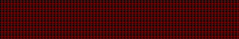



## Neon \(your text moves around electronical board\)

### Description

your text moves around an electronical neon board

you can set:

Left or Right moving direction /

picture of pixels (On & Off) /

speed (moving step and time interval) /

board size And Text
 
### More Info
 

             |
---                |---
**Submitted On**   |2001-09-03 01:25:06
**By**             |[Saeed Serpooshan](https://github.com/Planet-Source-Code/PSCIndex/blob/master/ByAuthor/saeed-serpooshan.md)
**Level**          |Intermediate
**User Rating**    |4.9 (84 globes from 17 users)
**Compatibility**  |VB 6\.0
**Category**       |[Graphics](https://github.com/Planet-Source-Code/PSCIndex/blob/master/ByCategory/graphics__1-46.md)
**World**          |[Visual Basic](https://github.com/Planet-Source-Code/PSCIndex/blob/master/ByWorld/visual-basic.md)
**Archive File**   |[Neon \(your265719172001\.zip](https://github.com/Planet-Source-Code/saeed-serpooshan-neon-your-text-moves-around-electronical-board__1-27317/archive/master.zip)

